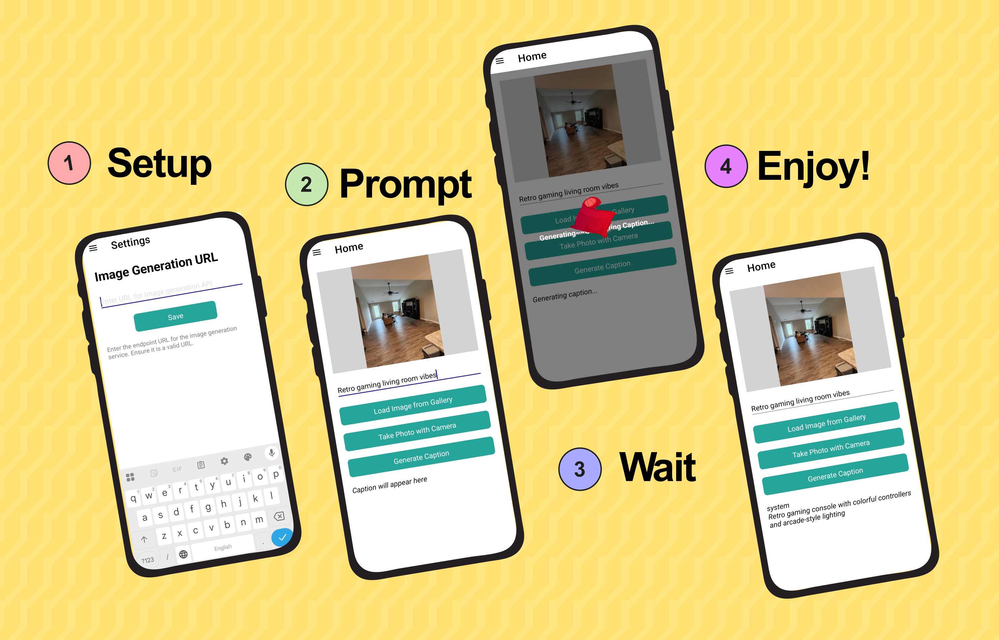

# 🏡 Interior Style Advisor – Cross-Platform Client

This is the companion mobile & desktop application for the [Interior Style Advisor Server](https://github.com/partzel/interior_style_advisor). Built with .NET MAUI, the app allows users to upload photos of rooms and receive personalized interior decor suggestions powered by AI.

---

## ✨ Features

- 📸 Upload images of your living space
- 🧠 Get instant AI-powered decoration advice
- 🎨 Supports mood-based or themed suggestions
- 📱 Works seamlessly across Android, iOS, Windows, and macOS

---

## 📸 Screenshots

### 📱 Mobile View


---

## ⚙️ How It Works

1. User selects or takes a room photo
2. The app sends it to the FastAPI server
3. The server returns a decor suggestion
4. The result is displayed in the UI

---

## 🚀 Getting Started

To build and run the client locally:

```bash
# In Visual Studio
Open `InteriorStyleAdvisorUI.sln` and build/run the target platform
````

Or via CLI:

```bash
dotnet build -t:Run -f net8.0-android
```

> Requires .NET 8 SDK and MAUI workloads installed.

---

## 🔗 Backend DISCLAIMER

As of now, there are no public deployments of the API. Please refer to the [API](https://github.com/partzel/interior_style_advisor) project to setup your own instance.

---

## 📄 License

MIT License. See [LICENSE](./LICENSE.txt) for details.

---

## 🙋‍♀️ Maintainer

Developed as part of a multimodal interior design assistant project for the Deep Learning course followed at Higher School of Computer Science 08 May 1945 Sidi Bel Abbes.
For questions, please reach out.
